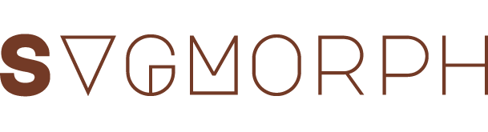

[](https://badge.fury.io/js/svgmorph.js)

SVGMorph is a javascript loading, morphing, parsing and sequencing library (oh my). 

Uses a non-homogeneous morphing algorithm, but it looks real purty ;P

## Examples

To see the sketches, run ```npm run dev``` and go through the 'examples/sketches[num]' folders.


